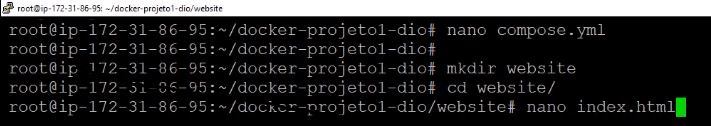
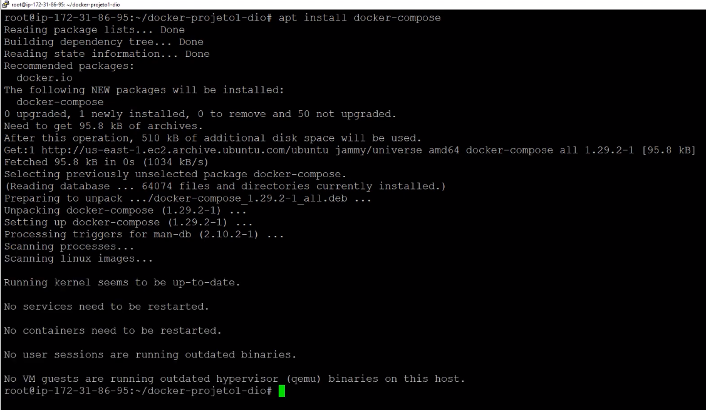
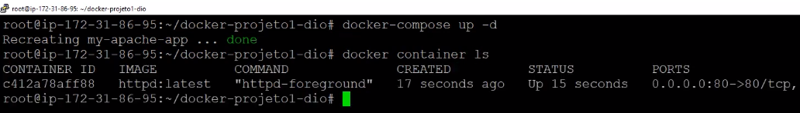
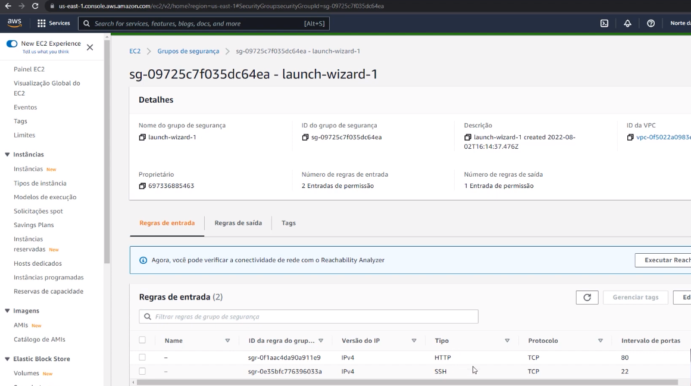
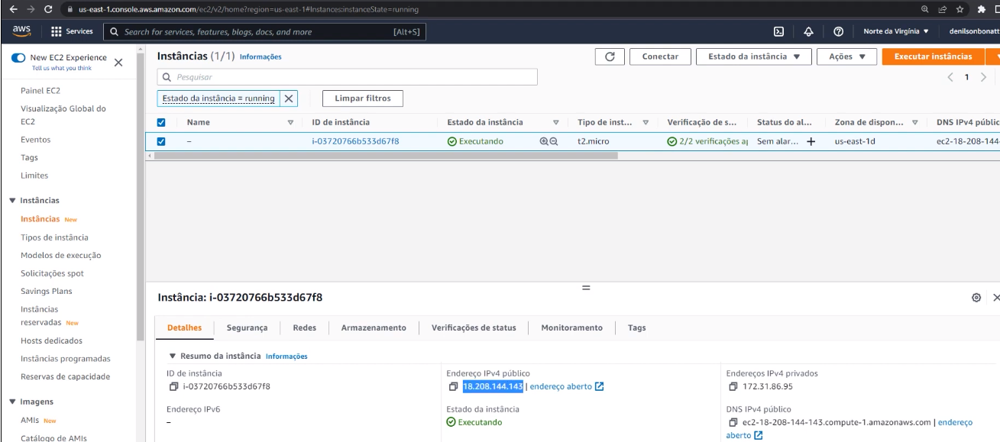

## Desafio

Docker Compose para executar uma aplicação HTML em um Container Apache.

## Resposta

Crie um diretório website e um arquivo HTML com o seguinte conteúdo:

```bash
<html>

<h1>Meu Primeiro projeto Docker</h1>

</html>
```

<p align="center">
  
</p>

Execute o comando para instalar o Docker Compose:

```bash
apt install docker-compose
```
<p align="center">
  
</p>

Depois o seguinte o comando:
```bash
docker-compose up -d
```
<p align="center">
  
</p>


Voltando ao ambiente cloud, verifique se o tráfego HTTP esteja liberado:
<p align="center">
  
</p>

Copie o endereço IP público:
<p align="center">
  
</p>

<p align="center">
  
</p>

