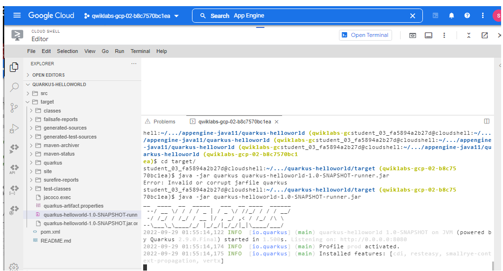

## Desafio

Utilizando o Cloud Shell

## Fazer clone de Repositório Git com comando:
[Link Repo java-docs-samples](https://github.com/GoogleCloudPlatform/java-docs-samples)

<p align="center">
  
</p>

```bash
 git clone LINK_REPO
```
- Depois de clonado, ir diretório java-docs-samples/appengine-java11/quarkus-helloworld

## Implantar um aplicativo Quarkus no Google App Engine padrão
- digitar comando mvn clean install
- ir para pasta target
- digitar comando java -jar [nome_artefato_gerado].jar

## O que o mvn clean install faz?
Apache Maven é uma ferramenta de construção popular, que pega o código-fonte Java do seu projeto, compila, testa e converte em um programa Java executável: um arquivo .jar ou .war.
1) Você está chamando o executável mvn, o que significa que você precisa do Maven instalado em sua máquina. )
2) Você está usando o comando clean, que excluirá todos os arquivos e recursos Java .class compilados anteriormente (como .properties) em seu projeto. Sua compilação começará do zero.
3) Install irá então compilar, testar e empacotar seu projeto Java e até mesmo instalar/copiar seu arquivo .jar/.war construído em seu repositório Maven local. 

## Resposta
<p align="center">
  
</p>

<p align="center">
  
</p>

<p align="center">
  
</p>

<p align="center">
  
</p>


